# Миграция Timeline: `apps/old` → `apps/timeline`

> Дата составления: 2026-03-25  
> Источник: `apps/old/src/app-old/timeline/`  
> Цель: `apps/timeline/src/app/timeline/`

---

## 1. Инвентаризация исходников

**Старый таймлайн** (`apps/old/src/app-old/timeline/`) — 14 файлов компонентов/директив, ~3 000 строк:

| Файл | Строк | Назначение |
|---|---|---|
| `timeline.component.ts` | ~1 250 | Главный оркестратор (загрузка данных, состояние, скролл) |
| `timeline-item.component.ts` | ~572 | Бар таска на графике (рекурсивный) |
| `timeline-table-item.component.ts` | ~317 | Строка таска в левой таблице (рекурсивная) |
| `timeline-ruler.component.ts` | ~215 | Временная ось (тики, сетка) |
| `scale/timeline-scale.component.ts` | ~112 | Контролы масштаба |
| `timeline-link.component.ts` | ~119 | Стрелки-зависимости между тасками |
| `timeline-item-flag.component.ts` | ~100 | Плавающие флаги меток |
| `timeline-item-drag.directive.ts` | ~84 | Drag для баров тасков |
| `timeline-holder.directive.ts` | ~82 | Pan-drag для холста графика |
| `roadmap/timeline-roadmap.component.ts` | ~125 | Строка майлстоунов (дорожная карта) |
| `roadmap/timeline-roadmap-item.component.ts` | ~152 | Один майлстоун |
| `workload/workload-user.component.ts` | ~125 | Строка загрузки пользователя |
| `workload/workload-user-stat.component.ts` | ~165 | Статистика периода загрузки |
| `workload/workload-user-item.component.ts` | ~153 | Бар таска в загрузке |

Итого: **14 компонентов/директив**, **3 шаблона вложенных в `apps/old`** (`table/`, `roadmap/`, `workload/`), **нет `TimelineModule`** (был частью `AppOldModule`).

---

## 2. Что меняется архитектурно

### 2.1 Антипаттерны старого кода, которые нужно исправить

| Проблема | Старый подход | Новый подход |
|---|---|---|
| View-state на дата-объектах | `issue.__selected`, `issue.__bounds`, `issue.__calculateBounds()`, `issue.__markForCheckItemTable()` — мутация | `TimelineStateService` с сигналами: `Map<issueId, IssueViewState>` |
| jQuery для DOM | `jQuery('.timeline-graph-content')[0].clientWidth` | `@ViewChild` + `ElementRef.nativeElement`, `contentWidth` через `@Input` от родителя |
| Анимация через jQuery | `jQuery({foo}).animate(...)` | CSS `scroll-behavior: smooth` + нативный `scrollTo` |
| Свободная типизация | `any` везде | Типы из `@renwu/core`: `Issue`, `Milestone`, `User`, `ListOptions` |
| NgModule | `declarations: [...]` | Standalone компоненты |
| Структурные директивы | `*ngIf`, `*ngFor`, `*ngSwitch` | Блочный синтаксис `@if`, `@for`, `@switch` |
| Ручной `takeUntil` + `destroy Subject` | `this.destroy.next(true)` | `takeUntilDestroyed()` + `DestroyRef` |
| Circular deps в roadmap-item | `import ... from './issue/issue.service'` (неверный путь) | Импорты из `@renwu/core` |

### 2.2 Маппинг зависимостей

| Старая зависимость | Новая зависимость |
|---|---|
| `jquery` | Удалить — заменить на нативный DOM / Angular ViewChild |
| `oz` → `JSONUtils` | `@renwu/utils` → `JSONUtils` |
| `oz` → `Color` | Убрать runtime Color(); использовать `status.color` (уже hex-строка из API) |
| `oz` → `ShortcutObservable` | `RwShortcutService` из `@renwu/core` (создать в Фазе 0) |
| `moment` | Оставить в первой итерации; планировать замену на `date-fns` (уже в зависимостях) |
| `md5` | Оставить (есть в workspace) |
| `RwDataService` | `RwDataService` из `@renwu/core` |
| `RwSettingsService` | `RwSettingsService` из `@renwu/core` |
| `RwUserService` | `RwUserService` из `@renwu/core` |
| `RwIssueService` | `RwIssueService` из `@renwu/core` |
| `RwToastService` | `RwToastService` из `@renwu/components` |
| `RwWebsocketService` | `RwWebsocketService` из `@renwu/core` |
| `RwAlertService` | `RwAlertService` из `@renwu/components` |
| `RwPolicyService` | `PolicyService` из `@renwu/core` |
| `RwContainerService` | `RwContainerService` из `@renwu/core` |
| `DateTime` (app-old local) | `IssueDateTime` из `@renwu/core` (уже использует `date-fns`) |
| `IssueFilterService` (app-old local) | `QueryBuilderService` из `@renwu/core` |
| `StateService` (app-old local) | `StateService` из `@renwu/core` |
| `SettingsService` (app-old local) | `RwSettingsService` из `@renwu/core` |
| `rw-button`, `rw-dropdown`, `rw-checkbox`, `rw-switch`, `rw-icon` | `@renwu/app-ui` — крупные общие блоки для всех remotes |
| `rw-select-old` | `@renwu/app-ui` |
| `query-builder` | `QueryBuilderComponent` из `@renwu/core` |
| `rwFormatUser` pipe | `FormatUserPipe` из `@renwu/core` |

### 2.3 Роль `TimelineService` в `libs/core`

Сейчас `libs/core/src/lib/timeline/timeline.service.ts` — пустой Injectable. Туда выносим **только общую логику**, которая может использоваться в других remotes (например, `apps/tasks`):

- Расчёт `dateStart`/`dateEnd` по набору issues (min/max date)
- Парсинг ссылок (`parseLinks`)
- Пересчёт индексов для отрисовки ссылок (`recalculateIndexes`)

View-state (selected, bounds) и специфичные для remote данные остаются в `apps/timeline/src/app/timeline/services/`.

---

## 3. Целевая файловая структура

```
libs/core/src/lib/timeline/
└── timeline.service.ts              # общая логика (min/max date, parseLinks, recalculateIndexes)

apps/timeline/src/app/timeline/
├── timeline.component.ts
├── timeline.component.html
├── timeline.component.scss
│
├── models/
│   ├── timeline-issue.model.ts       # IssueViewState, IssueBounds, TimelineIssue
│   └── timeline-settings.model.ts   # TimelineSettings interface
│
├── services/
│   ├── timeline-state.service.ts    # НОВЫЙ: signals-based view state (scoped к remote)
│   ├── timeline-settings.service.ts # localStorage persistence
│   └── timeline-data.service.ts     # фасад над RwDataService
│
├── scale/
│   ├── timeline-scale.component.ts
│   ├── timeline-scale.component.html
│   └── timeline-scale.component.scss
│
├── ruler/
│   ├── timeline-ruler.component.ts
│   ├── timeline-ruler.component.html
│   └── timeline-ruler.component.scss
│
├── table/
│   ├── timeline-table-item.component.ts
│   ├── timeline-table-item.component.html
│   └── timeline-table-item.component.scss
│
├── graph/
│   ├── timeline-item.component.ts
│   ├── timeline-item.component.html
│   ├── timeline-item.component.scss
│   ├── timeline-item-flag.component.ts
│   ├── timeline-item-flag.component.html
│   ├── timeline-item-flag.component.scss
│   ├── timeline-link.component.ts
│   ├── timeline-link.component.html
│   └── timeline-link.component.scss
│
├── roadmap/
│   ├── timeline-roadmap.component.ts
│   ├── timeline-roadmap.component.html
│   ├── timeline-roadmap.component.scss
│   ├── timeline-roadmap-item.component.ts
│   ├── timeline-roadmap-item.component.html
│   └── timeline-roadmap-item.component.scss
│
└── workload/
    ├── workload-user.component.ts
    ├── workload-user.component.html
    ├── workload-user.component.scss
    ├── workload-user-stat.component.ts
    ├── workload-user-stat.component.html
    ├── workload-user-stat.component.scss
    ├── workload-user-item.component.ts
    ├── workload-user-item.component.html
    └── workload-user-item.component.scss

apps/timeline/src/app/timeline/shared/directives/
    ├── timeline-item-drag.directive.ts
    └── timeline-holder.directive.ts
```

---
## 3.1 Что уже добавлено в репозиторий (по состоянию на текущий прогресс)

### `@renwu/core`
- `libs/core/src/lib/shortcut/shortcut.service.ts` — добавлен `RwShortcutService` (обёртка над `@renwu/components`, чтобы remotes могли импортировать из `@renwu/core`)
- `libs/core/src/lib/timeline/timeline.service.ts` — наполнена общая логика `calcMinMaxDate`, `parseLinks`, `recalculateIndexes`
- `package.json` + `package-lock.json` — добавлен `moment` для текущей итерации

### `apps/timeline`
- `apps/timeline/src/app/timeline/models/timeline-issue.model.ts`
- `apps/timeline/src/app/timeline/models/timeline-settings.model.ts`
- `apps/timeline/src/app/timeline/services/timeline-settings.service.ts`
- `apps/timeline/src/app/timeline/services/timeline-state.service.ts`
- `apps/timeline/src/app/timeline/services/timeline-data.service.ts`
- `apps/timeline/src/app/timeline/shared/directives/timeline-item-drag.directive.ts`
- `apps/timeline/src/app/timeline/shared/directives/timeline-holder.directive.ts`
- `apps/timeline/src/app/timeline/scale/timeline-scale.component.*`
- `apps/timeline/src/app/timeline/ruler/timeline-ruler.component.*`
- `apps/timeline/src/app/timeline/graph/timeline-item.component.*`
- `apps/timeline/src/app/timeline/graph/timeline-item-flag.component.*`
- `apps/timeline/src/app/timeline/graph/timeline-link.component.*`
- `apps/timeline/src/app/timeline/table/timeline-table-item.component.*`
- `apps/timeline/src/app/timeline/roadmap/timeline-roadmap.component.*`
- `apps/timeline/src/app/timeline/roadmap/timeline-roadmap-item.component.*`
- `apps/timeline/src/app/timeline/workload/workload-user.component.*`
- `apps/timeline/src/app/timeline/workload/workload-user-stat.component.*`
- `apps/timeline/src/app/timeline/workload/workload-user-item.component.*`
- обновлены `apps/timeline/src/app/timeline/timeline.component.ts` и `apps/timeline/src/app/timeline/timeline.component.html` (интеграция scale+ruler в `TimelineComponent`)
- обновлены:
  - `apps/timeline/src/app/timeline/services/timeline-settings.service.ts` (open-index API для expand/collapse)
  - `apps/timeline/src/app/timeline/table/timeline-table-item.component.*` (рекурсивный рендер + expand/collapse + scroll/select)
  - `apps/timeline/src/app/timeline/graph/timeline-item.component.*` (расчёт базовой геометрии бара + drag смещения + рекурсивный рендер)

---

## 4. Архитектурная диаграмма

```mermaid
flowchart TD
    subgraph entry [Entry / Routing]
        AppComp[AppComponent]
        MainComp[MainComponent]
        Routes[entry.routes.ts]
    end

    subgraph timeline_shell [TimelineComponent - оркестратор]
        TComp[timeline.component]
        TDataSvc[TimelineDataService]
        TStateSvc[TimelineStateService]
        TSettingsSvc[TimelineSettingsService]
    end

    subgraph controls [Контролы панели]
        Scale[TimelineScaleComponent]
    end

    subgraph left_panel [Левая панель - таблица]
        TableItem[TimelineTableItemComponent - рекурсивный]
    end

    subgraph right_panel [Правый граф]
        Ruler[TimelineRulerComponent]
        Roadmap[TimelineRoadmapComponent]
        RoadmapItem[TimelineRoadmapItemComponent]
        Holder[TimelineHolderDirective]
        Item[TimelineItemComponent - рекурсивный]
        ItemFlag[TimelineItemFlagComponent - рекурсивный]
        ItemDrag[TimelineItemDragDirective]
        Link[TimelineLinkComponent]
    end

    subgraph workload_panel [Нижняя панель - загрузка]
        WUser[WorkloadUserComponent]
        WUserStat[WorkloadUserStatComponent]
        WUserItem[WorkloadUserItemComponent]
    end

    subgraph core_libs ["@renwu/core (shared libs)"]
        DataSvc[RwDataService]
        UserSvc[RwUserService]
        ContSvc[RwContainerService]
        WsSvc[RwWebsocketService]
        SettSvc[RwSettingsService]
        PolicySvc[PolicyService]
        IssueSvc[RwIssueService]
        DateTime[IssueDateTime]
        QBSvc[QueryBuilderService]
        CoreState[StateService]
        ShortcutSvc[RwShortcutService - НОВЫЙ]
        TimelineSvc[TimelineService - общая логика]
    end

    subgraph app_ui ["@renwu/app-ui (shared UI)"]
        RwButton[rw-button]
        RwDropdown[rw-dropdown]
        RwCheckbox[rw-checkbox]
        RwSelect[rw-select-old]
        RwIcon[rw-icon]
        QBComp[QueryBuilderComponent]
    end

    AppComp --> Routes
    Routes --> MainComp --> TComp

    TComp --> Scale
    TComp --> TableItem
    TComp --> Ruler
    TComp --> Roadmap
    TComp --> Holder
    TComp --> Item
    TComp --> ItemFlag
    TComp --> Link
    TComp --> WUser

    Roadmap --> RoadmapItem
    Item --> ItemDrag
    WUser --> WUserStat
    WUser --> WUserItem

    TComp --> TDataSvc
    TComp --> TStateSvc
    TComp --> TSettingsSvc

    TDataSvc --> DataSvc
    TDataSvc --> ContSvc
    TDataSvc --> TimelineSvc
    TComp --> UserSvc
    TComp --> WsSvc
    TComp --> QBSvc
    TComp --> CoreState
    TComp --> ShortcutSvc
    TSettingsSvc --> SettSvc
    TableItem --> IssueSvc
    TableItem --> PolicySvc
    Item --> DateTime
    Ruler --> DateTime
    RoadmapItem --> DateTime
    TComp --> QBComp
    Scale --> RwButton
    TComp --> RwDropdown
```



---

## 5. Ключевое архитектурное решение: `TimelineStateService`

Самая большая проблема старого кода — состояние вида навешивается на объекты данных:

```typescript
// СТАРЫЙ антипаттерн: data-объект хранит view-callbacks
issue.__selected = true;
issue.__bounds = { left: 100, top: 2.5 ... };
issue.__calculateBounds = () => { ... };
issue.__markForCheckItemTable = () => { cd.markForCheck(); };
```

**Новый подход:** `TimelineStateService` — единственный источник view-state, доступный через dependency injection:

```typescript
// models/timeline-issue.model.ts
export interface IssueBounds {
  left: number;
  width: number;
  top: number;
  height: number;
  paddingTop: number;
  flagLogs: boolean;
}

export interface IssueViewState {
  selected: boolean;
  bounds: IssueBounds | null;
  showChilds: boolean;
  closed: boolean;
  index: number;
  countGroupBefore: number;
}

// services/timeline-state.service.ts  (scoped к remote, не в libs/core)
@Injectable()
export class TimelineStateService {
  private stateMap = signal<Map<string, IssueViewState>>(new Map());

  getState(issueId: string): Signal<IssueViewState | undefined> {
    return computed(() => this.stateMap().get(issueId));
  }

  setSelected(issueId: string, selected: boolean): void { ... }
  setBounds(issueId: string, bounds: IssueBounds): void { ... }
}
```

Общая логика пересчёта индексов выносится в `TimelineService` в `libs/core`:

```typescript
// libs/core/src/lib/timeline/timeline.service.ts
@Injectable({ providedIn: 'root' })
export class TimelineService {
  recalculateIndexes(rootChild: IssueTreeRoot): IndexMap { ... }
  parseLinks(issues: TimelineIssue[], issuesMap: Record<string, TimelineIssue>): TimelineLink[] { ... }
  calcMinMaxDate(groups: IssueGroup[]): { dateStart: Date; dateEnd: Date } { ... }
}
```

---

## 6. Фазы миграции

Порядок выстроен по зависимостям: каждая фаза не блокирует следующую по части сборки, но логически строится поверх предыдущей.

### Фаза 0 — Prerequisite: `RwShortcutService` в `libs/core`

**Место:** `libs/core/src/lib/shortcut/shortcut.service.ts`  
**Экспорт:** добавить в `libs/core/src/index.ts`

Что реализует (замена `ShortcutObservable` из `oz`):

```typescript
@Injectable({ providedIn: 'root' })
export class RwShortcutService {
  // Подписка на конкретную клавишу (или комбинацию)
  subscribe(key: string, handler: () => void): ShortcutRef
  // Отписка через возвращённый ref
  // Игнорирует события, когда фокус в input/textarea
}

interface ShortcutRef {
  unsubscribe(): void;
}
```

Таймлайн использует: `ArrowLeft`, `ArrowRight` для горизонтального скролла графика.

Также в `libs/core`:

#### `libs/core/src/lib/timeline/timeline.service.ts` — наполнить

```typescript
@Injectable({ providedIn: 'root' })
export class TimelineService {
  calcMinMaxDate(groups: IssueGroup[]): { dateStart: moment.Moment; dateEnd: moment.Moment }
  parseLinks(issues: TimelineIssue[], issuesMap: Record<string, TimelineIssue>): TimelineLink[]
  recalculateIndexes(rootChild: IssueTreeRoot): void  // обновляет index/countGroupBefore для каждого узла
}
```

---

### Фаза 1 — Модели и сервисы (фундамент в remote)

**Файлы для создания:**

#### `models/timeline-issue.model.ts`
- `IssueBounds` — геометрия бара на графике
- `IssueViewState` — view-state одного таска (selected, bounds, showChilds, closed, index)
- `TimelineIssue` — `Issue` из `@renwu/core` + `childs?: TimelineIssue[]`, `type?: 'root' | 'group'`, `__flagManual?`, `__flagNotPosted?`, `__opacity?`
- `IssueTreeRoot` — корневой узел дерева (`type: 'root'`, `childs: TimelineIssue[]`)
- `TimelineLink` — `{ from: TimelineIssue; to: TimelineIssue; type: 'before' | 'after' }`

#### `models/timeline-settings.model.ts`
- `TimelineSettings` — `scale`, `oldScale`, `scaleTick`, `grouping`, `showMilestones`, `showWorkforce`, `showTitleInside`, `showTitleRight`, `fontSize`, `tableWidth`, `sort`
- Использует `TimelineTicksId`, `TimelineScaleTick` из `@renwu/core`

#### `services/timeline-settings.service.ts`
- Загрузка/сохранение настроек в `localStorage` (`renwu_timeline_settings_${userId}`)
- `getTimeline(isWorkload: boolean): TimelineSettings`
- Геттеры/сеттеры для `scale`, `scaleTick`, `grouping`, `tableWidth`, `workforceHeight`
- Метод `getScaleValue(tickId: TimelineTicksId): number`
- `open_index` / `open_index_group` — сюда переносим из `RwSettingsService.user`

#### `services/timeline-state.service.ts` (НОВЫЙ, scoped к remote)
- Сигналы view-state для тасков
- `setSelected(id, val)`, `setBounds(id, bounds)`, `getViewState(id): Signal<...>`
- Провайдится через `providers: []` в `timeline.component.ts` (scoped к компоненту)

#### `services/timeline-data.service.ts`
- Фасад над `RwDataService` + `TimelineService`
- `loadIssueTree(containerId, grouping, filters): Observable<IssueGroup[]>`
- `loadMilestones(containerId): Observable<Milestone[]>`
- `loadUserWorkload(userId, filters): Observable<UserWorkload>`
- `loadUserWorkloadIssues(userId, filters): Observable<IssueGroup>`
- `saveIssue(id: string, patch: Partial<Issue>): Observable<Issue>`

---

### Фаза 2 — Директивы взаимодействия

#### `shared/directives/timeline-item-drag.directive.ts`
- Портирование напрямую из старого кода
- `standalone: true`
- Типизировать все `@Output`
- Переименовать селектор: `[renwuTimelineItemDrag]`

#### `shared/directives/timeline-holder.directive.ts`
- Аналогично, селектор `[renwuTimelineHolder]`

---

### Фаза 3 — Контролы масштаба

#### `scale/timeline-scale.component.ts`
- Selector: `renwu-timeline-scale`
- Убрать jQuery: `jQuery('.timeline-graph-content')[0].clientWidth` → принять `containerWidth: number` как `@Input` от родителя (родитель читает через `@ViewChild`)
- Заменить `RwSettingsService` → `TimelineSettingsService`
- Использовать компоненты из `@renwu/app-ui`: `rw-button`, `rw-select-old`
- Inputs: `dateStart: moment.Moment`, `dateEnd: moment.Moment`, `isWorkload: boolean`, `containerWidth: number`
- Outputs: `(changed)`, `(fitToScreen)`

---

### Фаза 4 — Временная ось (Ruler)

#### `ruler/timeline-ruler.component.ts`
- Selector: `renwu-timeline-ruler`
- Заменить `SettingsService` (app-old local) → `RwSettingsService` из `@renwu/core` для формата дат (`user.formats`)
- `DateTime` → `IssueDateTime` из `@renwu/core`
- Inputs: `scale`, `scaleTick`, `dateStart`, `dateEnd`, `selectedUsers`, `linesOnly?`, `selectMilestone?`
- Добавить TODO: заменить `moment locale` на `date-fns/locale` + `Intl.DateTimeFormat`
- `generateTickByInterval` — сохранить логику, типизировать входные данные

---

### Фаза 5 — Компоненты графика

#### `graph/timeline-item.component.ts`
- Selector: `renwu-timeline-item`
- Убрать `Color` из `oz`: вместо `new Color(issue.status.color)` использовать `status.color` напрямую как CSS-цвет
- Зарегистрировать bounds через `TimelineStateService.setBounds(id, bounds)` — вместо `issue.__calculateBounds`
- Вместо `issue.__markForCheckItemTable()` → `stateService.setSelected(id, val)`
- `IssueDateTime` из `@renwu/core` вместо `DateTime`
- Inputs: `item`, `scale`, `dateStart`, `dateEnd`, `showTitleInside`, `showTitleRight`, `containerTop?`, `selectMilestone?`, `timelineGraphContentBound?`
- Outputs: `(selected)`, `(scrollTo)`, `(dragIssueStart)`, `(dragIssueEnd)`, `(issueLaidOut)`, `(scrollRight)`, `(scrollLeft)`

#### `graph/timeline-item-flag.component.ts`
- Selector: `renwu-timeline-item-flag`
- Убрать мутацию `issue.__markForCheckFlagGraph`
- Inputs: `item`, Outputs: `(scrollTo)`, `(select)`

#### `graph/timeline-link.component.ts`
- Selector: `renwu-timeline-link`
- Практически чистый перенос — только типизировать `data: TimelineLink`, `issueBounds: IssueBounds`, `linkBounds: IssueBounds`
- Логика расчёта геометрии стрелки не меняется

---

### Фаза 6 — Левая панель (таблица)

#### `table/timeline-table-item.component.ts`
- Selector: `renwu-timeline-table-item`
- `RwSettingsService`, `PolicyService`, `RwIssueService` из `@renwu/core`
- `open_index` / `open_index_group` — перенести в `TimelineSettingsService`
- Вместо `issue.__markForCheckItemGraph/Flag()` → `stateService.setSelected(id, val)`
- `md5` оставить для хеширования ключа группы
- UI компоненты (status, assignees, type, priority) — из `@renwu/core` field-компонентов (`StatusComponent`, `AssigneesComponent`, etc.)
- Inputs: `issue`, `depth?`, `flagUpdate?`, `disableSelectedTimelineItem?`, `tableWidth?`
- Outputs: `(scrollTo)`, `(expanded)`, `(selected)`, `(createTooltip)`

---

### Фаза 7 — Майлстоуны (Roadmap)

#### `roadmap/timeline-roadmap.component.ts`
- Selector: `renwu-timeline-roadmap`
- Вынести `levelsRoadmap` (состояние layout) в локальный `signal`
- Использовать Angular `model()` (two-way signal binding) для `maxLevelRoadmap` и `selectMilestone` вместо пар `@Input`/`@Output`
- Inputs: `scale`, `dateStart`, `dateEnd`, `items: Milestone[]`
- `model()`: `maxLevelRoadmap`, `selectMilestone`

#### `roadmap/timeline-roadmap-item.component.ts`
- Selector: `renwu-timeline-roadmap-item`
- Исправить сломанные импорты из старого кода
- Оставить `inject(TimelineRoadmapComponent)` через DI — паттерн валиден для Angular (parent inject)
- `IssueDateTime` из `@renwu/core`
- `RwUserService` из `@renwu/core`

---

### Фаза 8 — Панель загрузки (Workload)

#### `workload/workload-user-item.component.ts`
- Selector: `renwu-timeline-workload-user-item`
- Убрать ручной расчёт virtual hours — использовать `IssueDateTime.setVirtualHours` из `@renwu/core`
- Типизировать `item` как `TimelineIssue`

#### `workload/workload-user-stat.component.ts`
- Selector: `renwu-timeline-workload-user-stat`
- Заменить `moment` → `date-fns` (startOf/endOf week/month/quarter, unix timestamp)
- Типизировать `workload` объект с сервера

#### `workload/workload-user.component.ts`
- Selector: `renwu-timeline-workload-user`
- Типизировать `workload`, `issues`

---

### Фаза 9 — Главный компонент (Timeline shell)

**Файл:** `timeline.component.ts` — рефакторинг существующего стаба.

1 250 строк старой логики разбиваются по ответственностям:

| Блок логики | Куда |
|---|---|
| Загрузка issues, milestones | `TimelineDataService` |
| `calcMinMaxDate`, `parseLinks`, `recalculateIndexes` | `TimelineService` из `@renwu/core` |
| localStorage настройки | `TimelineSettingsService` |
| View-state тасков (bounds, selected, index) | `TimelineStateService` |
| Resize таблицы (mousedown/mousemove) | Private метод компонента, `inject(Renderer2)` |
| Resize workload панели | Аналогично |
| Keyboard scroll (ArrowLeft/Right) | `RwShortcutService` из `@renwu/core` |
| WebSocket подписки | `takeUntilDestroyed` вместо ручного `destroy Subject` |
| URL state (query_hash) | `ActivatedRoute` + `Router` — паттерн сохранить |
| `center()` | Заменить jQuery animate на `el.nativeElement.scrollTo({behavior: 'smooth'})` |
| `getBoundingGraphHolder()` | `@ViewChild('graphHolder') graphHolder!: ElementRef` + `nativeElement.getBoundingClientRect()` |
| `getUserWorkloads()` | `TimelineDataService.loadUserWorkload()` |
| Режим workload профиля (`@Input() user`) | Получать текущего пользователя через `RwUserService.currentUser` — не нужен `@Input` |

**Skeleton компонента:**

```typescript
@Component({
  selector: 'renwu-timeline-timeline',
  standalone: true,
  templateUrl: './timeline.component.html',
  styleUrl: './timeline.component.scss',
  changeDetection: ChangeDetectionStrategy.OnPush,
  providers: [TimelineStateService, TimelineSettingsService, TimelineDataService],
})
export class TimelineComponent implements OnInit {
  private dataService = inject(TimelineDataService);
  private stateService = inject(TimelineStateService);
  private settingsService = inject(TimelineSettingsService);
  private timelineService = inject(TimelineService);   // @renwu/core
  private containerService = inject(RwContainerService);
  private websocketService = inject(RwWebsocketService);
  private userService = inject(RwUserService);
  private shortcutService = inject(RwShortcutService); // @renwu/core
  private destroyRef = inject(DestroyRef);

  // Signals
  scrollLeftGraph = signal(0);
  scrollTopGraph = signal(0);
  scrollTopWorkforce = signal(0);
  tableWidth = signal(200);
  rootChild = signal<IssueTreeRoot>({ childs: [], type: 'root' });
  links = signal<TimelineLink[]>([]);
  roadmapItems = signal<Milestone[]>([]);
  team = signal<TeamMember[]>([]);
  dateStart = signal<moment.Moment | null>(null);
  dateEnd = signal<moment.Moment | null>(null);
  ...
}
```

---

### Фаза 10 — Стили и i18n

1. Перенести все `.scss` файлы без изменений в первой итерации
2. Заменить `rw-*` CSS-переменные на актуальные из `styles/styles.scss`
3. Добавить ключи переводов в `apps/timeline/src/i18n/en.json`, `ru.json`, `zh.json`
4. Заменить все `i18n` атрибуты из шаблонов на `{{ 'key' | transloco }}`
5. Tailwind — использовать там, где layout (flex, gap, overflow), не трогать специфичные позиционные стили графика

---

## 7. Порядок создания файлов (с зависимостями)

```
Фаза 0 (prerequisite, в libs/core):
  libs/core/src/lib/shortcut/shortcut.service.ts  ← НОВЫЙ
  libs/core/src/lib/timeline/timeline.service.ts  ← наполнить

Фаза 1 (нет внешних зависимостей, в remote):
  models/timeline-issue.model.ts
  models/timeline-settings.model.ts
  services/timeline-settings.service.ts
  services/timeline-state.service.ts
  services/timeline-data.service.ts

Фаза 2 (нет зависимостей от других компонентов таймлайна):
  shared/directives/timeline-item-drag.directive.ts
  shared/directives/timeline-holder.directive.ts

Фаза 3 (зависит от: timeline-settings.service, @renwu/app-ui):
  scale/timeline-scale.component.*

Фаза 4 (зависит от: timeline-settings.service, IssueDateTime из @renwu/core):
  ruler/timeline-ruler.component.*

Фаза 5 (зависит от: timeline-state.service, IssueDateTime, directives):
  graph/timeline-item.component.*
  graph/timeline-item-flag.component.*
  graph/timeline-link.component.*

Фаза 6 (зависит от: timeline-state.service, timeline-settings.service):
  table/timeline-table-item.component.*

Фаза 7 (зависит от: timeline-state.service, IssueDateTime):
  roadmap/timeline-roadmap.component.*
  roadmap/timeline-roadmap-item.component.*

Фаза 8 (зависит от: IssueDateTime из @renwu/core):
  workload/workload-user.component.*
  workload/workload-user-stat.component.*
  workload/workload-user-item.component.*

Фаза 9 (зависит от всего выше):
  timeline.component.ts  ← рефакторинг стаба

Фаза 10 (параллельно с фазами 3-9 или в конце):
  Стили, i18n
```

---

## 8. Решённые вопросы

| # | Вопрос | Решение |
|---|---|---|
| 1 | `ShortcutObservable` из `oz` | Создать `RwShortcutService` в `libs/core` (Фаза 0) |
| 2 | Режим workload профиля (`@Input() user`) | Использовать `RwUserService.currentUser` — `@Input` не нужен |
| 3 | `<query-builder>` | `QueryBuilderComponent` из `@renwu/core` |
| 4 | `rw-button`, `rw-dropdown`, `rw-checkbox` и т.д. | Из `@renwu/app-ui` — крупные общие блоки для всех remotes |
| 5 | `rwFormatUser` pipe | `FormatUserPipe` из `@renwu/core` |
| 6 | `TimelineService` в `libs/core` | Наполнить общей логикой: `calcMinMaxDate`, `parseLinks`, `recalculateIndexes` |
| 7 | `WorkloadUserItemComponent` не используется в шаблоне | Переносим — он корректный компонент, вероятно баг в старом шаблоне |

---

## 9. Чеклист приёмки

- [ ] Все компоненты `standalone: true`, без NgModule
- [ ] Нет `any` в публичных интерфейсах (только внутренние `TODO: any` с комментарием)
- [ ] Нет `jQuery` импортов
- [ ] Нет `oz` импортов (кроме временных с TODO)
- [ ] Все `__` runtime properties заменены на `TimelineStateService`
- [ ] Все компоненты с prefix `renwu-timeline-*`
- [ ] `ChangeDetectionStrategy.OnPush` на всех компонентах
- [ ] Нет ручного `destroy Subject` — используется `takeUntilDestroyed`
- [ ] Шаблоны используют `@if`, `@for`, `@switch` вместо `*ngIf`, `*ngFor`, `*ngSwitch`
- [x] `RwShortcutService` создан в `libs/core` и экспортирован из `index.ts`
- [x] `TimelineService` в `libs/core` содержит общую логику
- [ ] Строки i18n в JSON файлах
- [x] Нет ошибок линитера (`nx lint timeline`)
- [x] `nx build timeline` проходит в production mode
